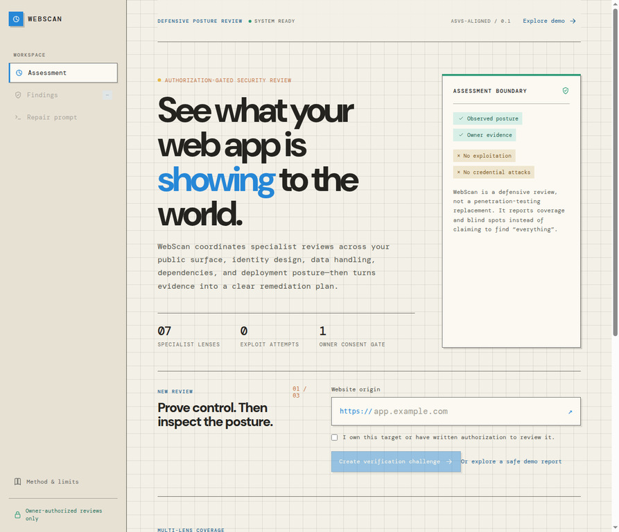
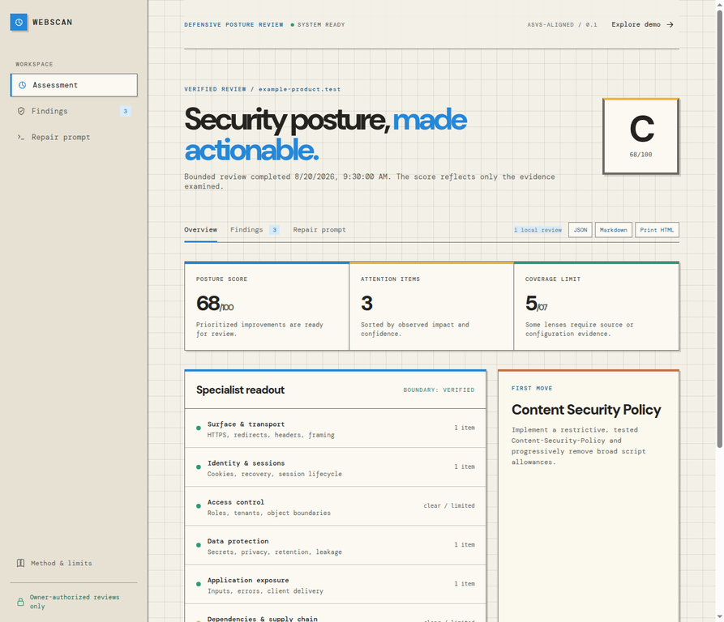

# WebScan

> **🛡️ A 15-agent, authorization-gated defensive security posture review for modern web apps.**

<p align="center">
  <strong>Own the target. Verify control. Add redacted evidence. Review what the agents observed. Fix with confidence.</strong>
</p>

<p align="center">
  <a href="#quick-start">Quick start</a> ·
  <a href="#15-agent-coverage">15 agents</a> ·
  <a href="#owner-evidence">Owner evidence</a> ·
  <a href="#controlled-expanded-audit">Controlled audit</a> ·
  <a href="#pdf-only-reports">PDF reports</a>
</p>





## ✨ What is WebScan?

WebScan coordinates **15 defensive agents** to help an authorized website owner turn observable security signals and carefully redacted owner evidence into a prioritized remediation plan. A review shows what was observed, how confident WebScan is, what remains outside coverage, how to verify a fix, and a safe coding-assistant brief for the next engineering step.

> **No account. No sign-in. No password.** WebScan begins with a website URL, an explicit authorization acknowledgement, and a one-time domain-verification file. Local review history stays in the browser on the device being used.


| 🧭 You provide | 🔎 The 15 agents review | 🧰 You receive |
| --- | --- | --- |
| A public website you own or are explicitly authorized to assess | Verified public response signals and, optionally, selected redacted source/configuration material | Score, agent coverage, evidence-backed findings, remediation guidance, verification criteria, and an AI coding prompt |


## 🚀 Quick start

WebScan is a local web application. You need **Git**, **Node.js 22 or later**, and **pnpm**. No API key, database, Docker setup, account, or production secret is required to run the project locally.

On macOS or Linux, run:

```bash
git clone https://github.com/hctorfrrs17-tech/WebScan.git
cd WebScan
pnpm install
pnpm dev
```

Then open [http://127.0.0.1:5173](http://127.0.0.1:5173). The `pnpm dev` command starts the frontend on port `5173` and its local API on port `8787` together. To stop both, return to the terminal and press `Ctrl+C`.

> **Windows:** Run the same commands inside [WSL](https://learn.microsoft.com/windows/wsl/install). The project’s development command uses standard shell environment-variable syntax, so WSL is the supported Windows path.

### The review flow

| Step | What happens |
| --- | --- |
| **01 — Confirm** | Enter a complete HTTP/HTTPS origin and confirm that you own it or have written authorization. |
| **02 — Add evidence** | Optionally select redacted source, dependency, CI, or deployment files so the owner-evidence agents can review real context. |
| **03 — Verify** | Publish the one-time token at `/.well-known/webscan-verification.txt`. |
| **04 — Review** | Run the bounded defensive review and inspect the score, agent coverage, limits, findings, and repair brief. |


## 🤖 15-agent coverage

The first five agents review a verified public response. The remaining agents become more useful when the owner selects redacted source or configuration evidence. Each agent is defensive only: it reports observed cues and remediation objectives, never exploit payloads or bypass instructions.

| # | Agent | Primary focus |
| ---: | --- | --- |
| 01 | **Transport agent** | HTTPS, redirects, HSTS, secure response delivery. |
| 02 | **Browser isolation agent** | CSP, framing, MIME protections, browser permissions. |
| 03 | **Session agent** | Visible cookie attributes, recovery and session boundaries. |
| 04 | **Authentication agent** | Owner-provided authentication-flow evidence. |
| 05 | **Authorization agent** | Roles, tenants, object ownership and server-side boundaries. |
| 06 | **Input safety agent** | Validation, encoding, unsafe rendering and upload-handling cues. |
| 07 | **Client exposure agent** | Client delivery, metadata, HTTP resources and public endpoint cues. |
| 08 | **API & error agent** | Route structure, response behavior and error-handling cues. |
| 09 | **Data privacy agent** | Referrer controls, data-minimization and lifecycle cues. |
| 10 | **Configuration hygiene agent** | Redacted configuration and environment-separation cues. |
| 11 | **Dependency agent** | Manifest, lockfile and package-hygiene cues. |
| 12 | **Supply-chain agent** | Build, CI and release workflow evidence. |
| 13 | **Deployment agent** | Runtime, headers and hosting-configuration evidence. |
| 14 | **Logging & recovery agent** | Logging, recovery and auditability cues. |
| 15 | **Storage & cryptography agent** | Storage, cryptography and data-lifecycle evidence. |

Read [AGENT_COVERAGE.md](AGENT_COVERAGE.md) for the complete evidence map and boundaries for every agent. [AGENT_EXPANSION.md](AGENT_EXPANSION.md) lists the expanded concrete signals reviewed by each agent. [AGENT_EVIDENCE_POLICY.md](AGENT_EVIDENCE_POLICY.md) defines the concrete signal threshold required before an owner-evidence agent creates an actionable finding.

## 📎 Owner evidence

Owner evidence is **optional**, but it makes the authentication, authorization, input, dependency, supply-chain, deployment, logging, and storage agents substantially more useful. WebScan accepts up to eight small text files for the current review only, such as selected `.ts`/`.tsx`/`.js` files, `package.json`, lockfiles, CI workflows, redacted deployment configuration, or a safe `settings.txt` template.

> TIP: The more information, files, and code you provide, the better the security analysis will be—and consequently, the security of your website or web app can be further improved.

| ✅ Appropriate evidence | ⛔ Never submit |
| --- | --- |
| Selected source files with the relevant control flow | Real `.env` files, credentials, tokens, private keys, connection strings, or personal data |
| `package.json`, lockfile, CI workflow, deployment template | Production secrets or complete raw database/application backups |
| Redacted configuration examples with placeholders | Any file you are not authorized to share |

The API rejects real environment-file names and common live-secret patterns. Evidence is used for the current in-memory review only; the report keeps a **summary** of files and types reviewed, not their contents.

## 📤 PDF-only reports

Every completed review has one export action: **Export PDF**. It opens the browser print dialog with a self-contained A4 report; select **Save to PDF** to store it. 

| PDF section | What it contains |
| --- | --- |
| **Score & scope** | Target, grade, posture score, coverage, evidence summary, and explicit limitations. |
| **Detailed agent readouts** | An attributed section for each of the 15 agents, including its evidence scope, completion state, observed controls, and every evidence-backed finding. Every attention finding specifies an observed signal, why it matters, a required change, and an acceptance check. |
| **Consolidated remediation prompt** | The complete AI-coding prompt at the end of the PDF, containing only the fixes supported by the preceding agent findings and the defensive implementation constraints. |

The PDF never includes raw cookie values, credentials, submitted evidence contents, tokens, API keys, passwords, or private keys.

## 🧪 Controlled expanded audit

> The PDF below is a report test made with a simple web made with [Manus AI](https://manus.im/app). In a real web ( authentication, password resets, real database, API Keys, secrets...) WebScan would've found *many* more vulnerabilities and therefore the report would be better and the security improvement much better. 

### Result snapshot

| Result | Value |
| --- | --- |
| **Posture score** | **20 / 100** |
| **Grade** | **E** |
| **Attention items** | **29 evidence-backed findings** |
| **Agent coverage** | **15 / 15 agents completed** |
| **Owner evidence** | **8 redacted files**, summarized but not retained in the report |
| **Limits maintained** | No credentialed testing, exploitation, fuzzing, brute force, or denial-of-service testing |


### Detailed PDF result

The controlled audit was rendered into a **28-page A4 PDF** after the review. It contains the score and scope, explicit readouts for all 15 agents, the 29 evidence-backed findings, their individual observed signal/required change/acceptance check fields, and the **complete consolidated remediation prompt** on the final page.

**Audit test PDF:** [Download the 15-agent report](https://github.com/hctorfrrs17-tech/WebScan/raw/refs/heads/main/examples/controlled-audit-report.pdf). 

## 🔐 Safety boundary

WebScan is a **defensive, owner-authorized** review. It rejects local and private network destinations, metadata-style hosts, URL credentials, and non-standard ports. It resolves public DNS before requesting a target, uses an 8-second timeout, limits sampled HTML, and does not follow redirects.

| ✅ In scope | ⛔ Out of scope |
| --- | --- |
| Bounded public-response review of a verified domain you control | Unverified third-party targets, intranets, local networks, or arbitrary ports |
| Owner-selected, redacted evidence reviewed for the current assessment | Exploitation, credential attacks, bypasses, fuzzing, stealth scanning, brute force, or denial-of-service testing |
| Transparent evidence, coverage, confidence, limitations, and remediation criteria | Claims that a website has no vulnerabilities or that every vulnerability was found |

> A verification file confirms a minimal level of domain control. It is not a substitute for a formal scope agreement, a penetration test, or a complete application-security review.


## ✅ Quality checks

```bash
pnpm test
pnpm check
pnpm build
```

## 🤝 Contributing and reporting security issues

Contributions are welcome when they protect the defensive-only boundary. Please read [CONTRIBUTING.md](CONTRIBUTING.md) before opening a pull request. To report a project security concern privately, follow [SECURITY.md](SECURITY.md) rather than opening a public issue.

## 📚 References

WebScan uses the OWASP Application Security Verification Standard v5.0.0 as a guidance baseline and the OWASP Web Security Testing Guide for assessment context. These resources do not authorize testing on targets you do not control. [1] [2]

[1]: https://owasp.org/www-project-application-security-verification-standard/ "OWASP Application Security Verification Standard"
[2]: https://owasp.org/www-project-web-security-testing-guide/ "OWASP Web Security Testing Guide"

## 📜 License

WebScan is released under the [MIT License](LICENSE).
